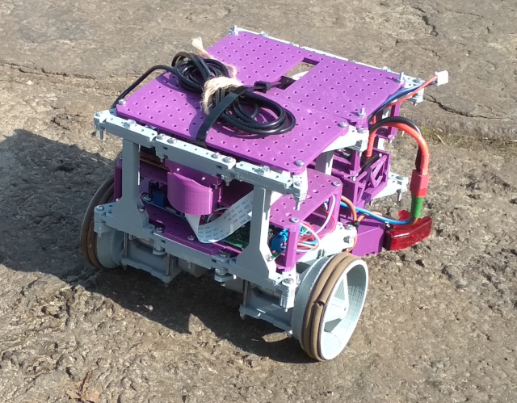

================================================================================
Projekt QBot - oprogramowanie do mini-platformy mobilnej
================================================================================

Wstęp
--------------------------------------------------------------------------------

Celem jest stworzenie stosu oprogramowania do 3-kołowego (2 napędowe) robota pod postacią trzech modułów (poziomów 'L' - *ang. level*):

* L0, Mikrokontrolery - pojedynczy mikrokontroler Atmega 328p pod postacią płytki Arduino Nano sterujący mostkiem-H `MC33926 <https://botland.com.pl/pl/arduino-shield-kontrolery-silnikow-i-serw/1417-pololu-mc33926-dwukanalowy-sterownik-silnikow-28v3a-shield-dla-arduino.html>`_ i odczytujący dane z enkoderów umieszczonych na wale `silnika <https://botland.com.pl/pl/silniki-dc-z-przekladnia-i-enkoderami/9531-silnik-z-przekladnia-6v-210rpm-enkoder.html>`_.
* L1, Raspberry Pi 3B+ - łączy mikrokontrolery z komputerem bazy wprowadzając dodatkową warstwę abstrakcji (reguła DIP). Obsługuje połączenie szeregowe oraz komunikację ze stacją bazową. Wprowadza model podwozia.
* L2, Aplikacja bazy - odbiera dane z gamepada/joysticka i wysyła ja z użyciem wybranego protokołu do L1. Otrzymuje telemetrię i wyświetla telemetrię robota.

Proponowany projekt wywodzi się z już istniejącego stosu aplikacji napisanych z użyciem frameworka Qt. Ze względu na ciężkość frameworka i czasochłonność konfiguracji środowiska postanawia się przepisanie systemu do bibliotek lżejszych i łatwiejszych do skonfigurowania. Kod źródłowy pierwotnego projektu Qt: `<https://github.com/rCorvidae/Qt-OrionPi>`_

   Omawiana platforma

Wymagania
--------------------------------------------------------------------------------

Poziom L0 - mikrokontroler
................................................................................

.. list-table:: Wymagania L0
   :widths: 15 20 35
   :header-rows: 1

   * - ID
     - Wymaganie
     - Opis

   * - REQ-L0-01
     - Regulacja mocy silnika
     - Ustawia zadane wypełnienie PWM w otwartej pętli

   * - REQ-L0-02
     - Częstotliwość PWM min. 20kHz
     - Ustawia PWM na częstotliwość niesłyszalną dla ludzkiego ucha

   * - REQ-L0-03
     - Odczyt zużycia prądu w danej chwili
     - Odczytuje z ADC chwilowe pobór prądu przez silnik

   * - REQ-L0-05
     - Odczyt enkoderów
     - Odczytuje tick-i z enkodera w przerwaniu

   * - REQ-L0-06
     - JSON API
     - Udostępnia właściwe API do komputera pokładowego w postaci JSON'a

   * - REQ-EXTRAL0-01
     - Nastawia wybraną prędkość kątową kół
     - Udostępnia API do zadania prędkośći kątowej na koło

   * - REQ-EXTRAL0-02
     - Kontroler PID
     - Implementuje kontroler PID. Zachowuje zadaną prędkość kątową

   * - REQ-EXTRAL0-03
     - Dynamiczna zmiana parametrów PID
     - Udostępnia API do zmiany stałych PID, w celu przyśpieszenia ich wyznaczenia

Poziom L1 - Raspberry PI
................................................................................

.. list-table:: Wymagania L1
   :widths: 15 20 35
   :header-rows: 1

   * - ID
     - Wymaganie
     - Opis

   * - REQ-L1-01
     - Obsługa portu szeregowego
     - Wykrywa dostępne urządzenia UART

   * - REQ-L1-02
     - UART - Hot Plug
     - Umożliwia się (p)odpinanie urządzeń podczas działania aplikacji

   * - REQ-L1-03
     - Wysyłanie poleceń do drivera
     - Wysyła polecenia REQ-L0-01 i REQ-EXTRAL0-01 do mikrokontrolerów

   * - REQ-L1-04
     - Odbiór danych pomiarowych
     - Odbiera dane o chwilowej prędkości kątowej, poborze prądu

   * - REQ-L1-05
     - Dostęp do telemetrii
     - Udostępnia usługę na wzór HTTP w której prezentuje się telemetrię

   * - REQ-L1-06
     - Odbiór poleceń sterujących
     - Odbiera polecenia sterujące jako stream danych w trybie sterowania mocą. Odebrane dane: kierunek i zwrot (wektor jednostkowy), wartość przepustnicy

   * - REQ-L1-07
     - Model podwozia
     - Implementuje podstawowy model podwozia, umożliwiając sterowanie zgodnie z REQ-L1-06

   * - REQ-L1-08
     - Odbiór polecenia udostępnienia kamery
     - Uruchamia serwer NetCat streamujący obraz z kamery po UDP

   * - REQ-EXTRAL1-01
     - Skrypt poleceń
     - Umożliwia się wykonywanie gotowego skryptu wg którego robot przemieszcza się

   * - REQ-EXTRAL1-02
     - Odbiór skryptu poleceń
     - Odbiera z komputera bazy skrypt poleceń (REQ-EXTRAL1-01) i wykonuje go zgodnie z zadanymi parametrami

   * - REQ-EXTRAL1-03
     - Skrypt do pokonywania łuku
     - Udostępnia się opcję pokonywania zakrętu pod postacią łuku.

   * - REQ-EXTRAL1-04
     - Uchwyt do autonomii
     - Projektuje się strukturę obiektów, by umożliwić w przyszłości implementację podstawową autonomię robota bazując na SLAM (wykorzystując m.in. IMU, VO)

Poziom L2 - aplikacja bazy
................................................................................

Aplikacja L2 nie jest głównym celem projektu. Jej celem jest jedynie zademonstrowanie możliwości oprogramowania pozostałych poziomów. Ze względu na stopień skomplikowania stosu aplikacji, aplikacja L2 może zostać napisana w pythonie z użyciem Qt'a lub bazować na pierwotnej aplikacji Qt-OrionPi

.. list-table:: Wymagania L2
   :widths: 15 20 35
   :header-rows: 1

   * - ID
     - Wymaganie
     - Opis

   * - REQ-L2-01
     - Odbiór położenia kontrolera
     - Odczytuje położenia analogowych czujników kontrolera oraz przyciski cyfrowe

   * - REQ-L2-01
     - Wyznaczenie martwej strefy kontrolera
     - Wyznacza się procentową martwą strefę kontrolera, która nie powoduje eventu wysyłania danych do L1

   * - REQ-L2-03
     - Wysyła polecenia 
     - Wysyła polecenia zgodne z REQ-L1-06 po wstępnym przetworzeniu danych z REQ-L2-01

   * - REQ-L2-04
     - Telemetria
     - Prezentuje w czasie rzeczywistym odebraną telemetrię w czasie rzeczywistym.

   * - REQ-L2-05
     - Obraz z kamery
     - Uruchamia aplikację odbierającą obraz z kamery pokładowej, po otrzymaniu informacji uruchomienia serwera, zgodnie z REQ-L1-08

   * - REQ-EXTRAL2-01
     - Serializacja skryptu poleceń
     - Serializuje i wysyła skrypt poleceń do L1, zgodnie z REQ-EXTRAL1-01 i REQ-EXTRAL1-02

Założenia projektowe
--------------------------------------------------------------------------------

Ogólne
................................................................................

.. list-table:: Ogólne założenia projektowe
   :widths: 15 20 35
   :header-rows: 1

   * - ID
     - Założenie
     - Opis

   * - ASM-GEN-01
     - Język programowania
     - C++ w wersji min. c++11, preferencyjnie c++14

   * - ASM-GEN-02
     - AVR: MISRA
     - O ile możliwe, wdrożyć i dostosować reguły zgodne z MISRA np. `<https://lars-lab.jpl.nasa.gov/JPL_Coding_Standard_C.pdf>`_

   * - ASM-GEN-03
     - Biblioteki
     - AVR: biblioteka do JSON/nanopb; RPi: gRPC, protobuf, boost, Baza: gRPC, Qt, protobuf

   * - ASM-GEN-04
     - Metodologia
     - TDD

   * - ASM-GEN-05
     - Deployment
     - Instalacja bare metal (RPi), co możliwe należy uruchamiać z użyciem Docker'a

   * - ASM-GEN-05
     - System budowania
     - W zależności od wybranej platformy, qmake, cmake, zależne od IDE

   * - ASM-GEN-06
     - Platformy
     - AVR: wsad; RPi: Arch Linux, w przypadku Dockera rozważany Hypriot, aplikacja desktopowa: Arch Linux

